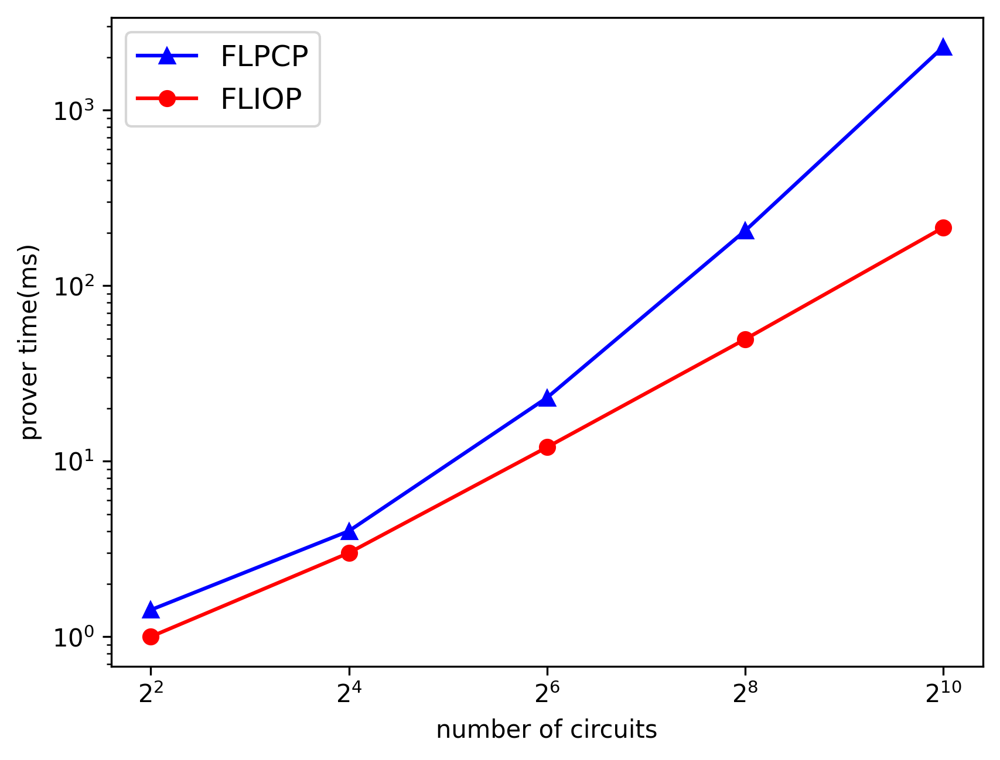
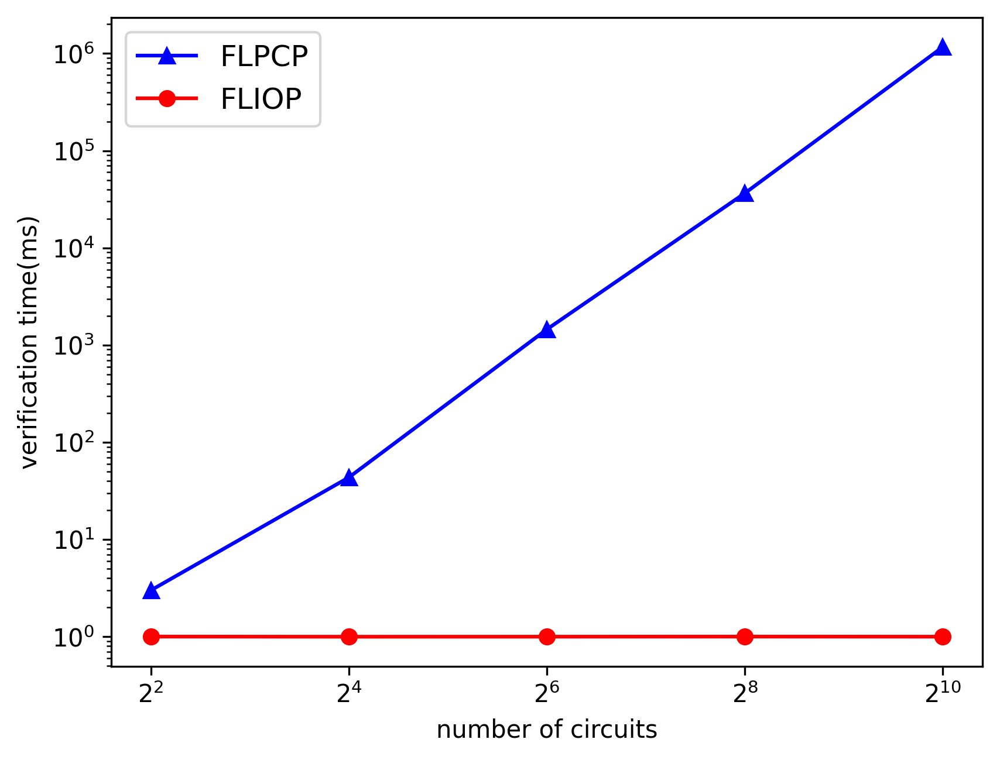
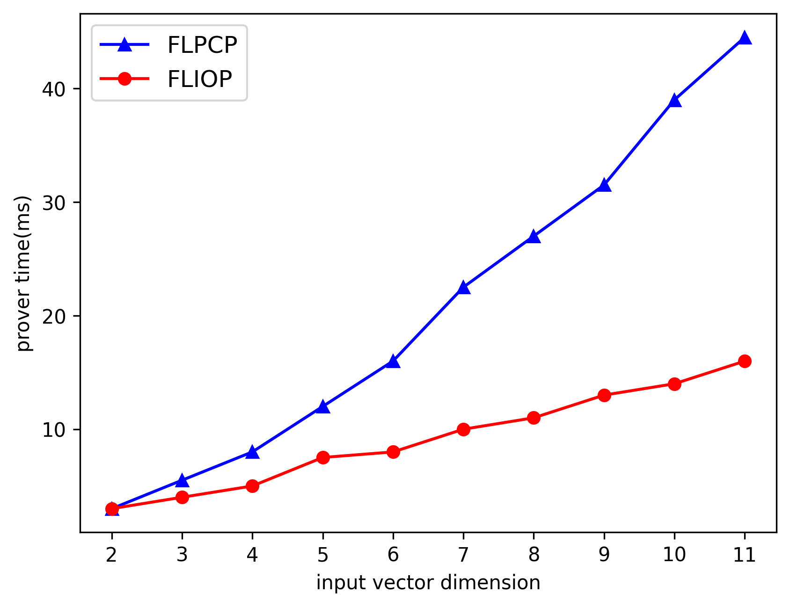
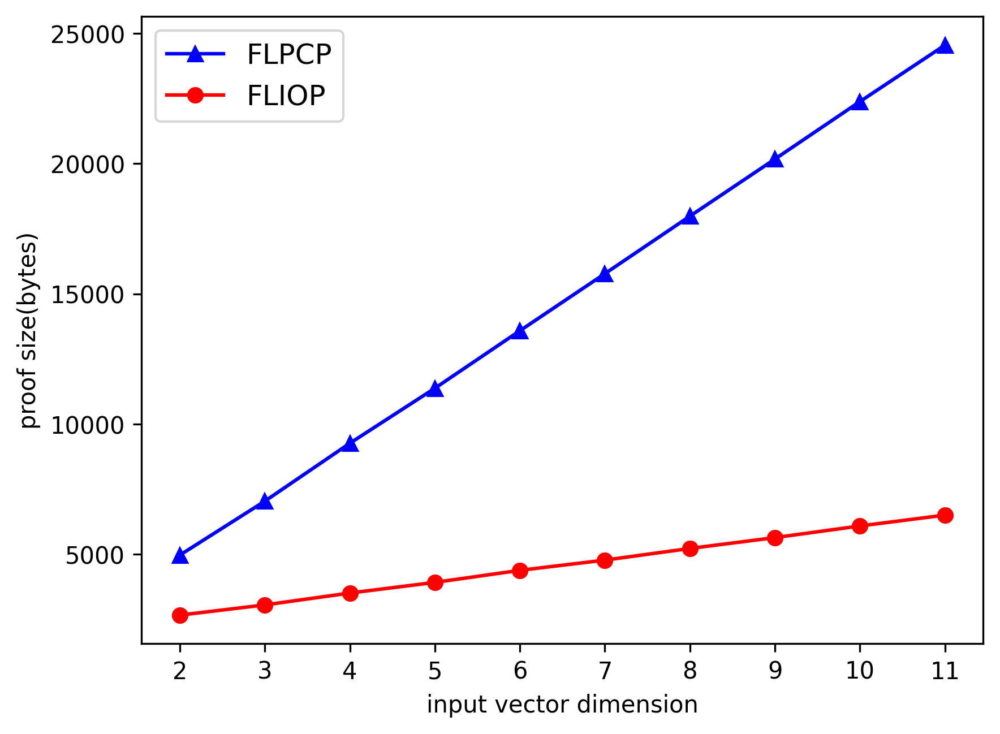

# Simple fully linear PCP simulator

This is the python implementation of simple [fully linear PCP](https://eprint.iacr.org/2019/188.pdf) simulator using [gmpy2](https://gmpy2.readthedocs.io/en/latest/).

## Run

This project is implemented on [Pipenv](https://pipenv.pypa.io/en/latest/) environment.
You should refer to Pipfile for information on the necessary python package.
If pipenv is installed on your system, you can run this program through the following commands on this project path.

```shell
pipenv install
pipenv shell
python3 TestComplexCircuit.py
```

or

```shell
pipenv install
pipenv shell
python3 TestInnerProductCircuit.py
```

If you would like to run recursive linear IOP for parallel-sum circuit, run following command.

```shell
python3 TestInnerProductParallelCircuit.py
```

Then, you can compare recursive linear IOP for parallel-sum circuit with short proofs for parallel-sum circuit
whose result can obtained through running following command.

```shell
python3 TestInnerProductParallelCircuitWithoutIOP.py
```

## Result

In a graph in which the x-axis is vector dimension, the number of circuits is fixed at 16.

* Comparison between FLPCP and FLIOP








See `Experiments.py` for code used to conduct experiments and draw graphs!

## Project Structure

```
├── Base                         // Containing abstract class
│   ├── Circuit.py               // Abstract circuit class. All custom circuit class should inherit from this class
│   ├── Gate.py                  // Abstract gate class, add gate class, constant multiplication gate class, and multiplication gate class
│   ├── ParallelSum.py           // Parallel sum circuit class. It is used for recursive linear IOP.
│   ├── ParallelSumRootM.py      // Parallel sum circuit class. It is used for short proofs for parallel circuit.
│   └── GGate.py                 // Abstract G-gate class. All custom G-gate class should inherit from this class
├── Custom                       // Containing User custom circuit
│   ├── InnerProductGGate.py     // Custom G-gate to perform inner product
│   ├── InnerProductCircuit.py   // Custom circuit containing only one inner product G-gate
│   └── ComplexCircuit.py        // Custom circuit containing many add gate, cmul gate, and inner product G-gate
├── Unit                         // Calculation unit
│   ├── Operand.py               // Abstract class of all operand class of circuit and G-gate
│   ├── Integer.py               // Modular Integer
│   ├── Proof.py                 // Proof vector
│   ├── Query.py                 // Query vector
│   └── Polynomial.py            // Containing polynomial coefficient vector
├── Pipfile
├── Pipfile.lock
├── TestComplexCircuit.py                     // Run this .py file to test FLPCP for complex circuit
├── TestInnerProductParallelSum.py            // Run this .py file to test recursive linear IOP for parallel-sum inner product circuit
├── TestInnerProductParallelSumWithoutIOP.py  // Run this .py file to test short proofs FLPCP for parallel-sum inner product circuit
└── TestInnerProductCircuit.py                // Run this .py file to test FLPCP for simple inner product circuit
```

## Reference

* paper: [Zero-Knowledge Proofs on Secret-Shared Data via Fully Linear PCPs (CRYPTO 2019)](https://eprint.iacr.org/2019/188.pdf)
* core library: [gmpy2](https://gmpy2.readthedocs.io/en/latest/)